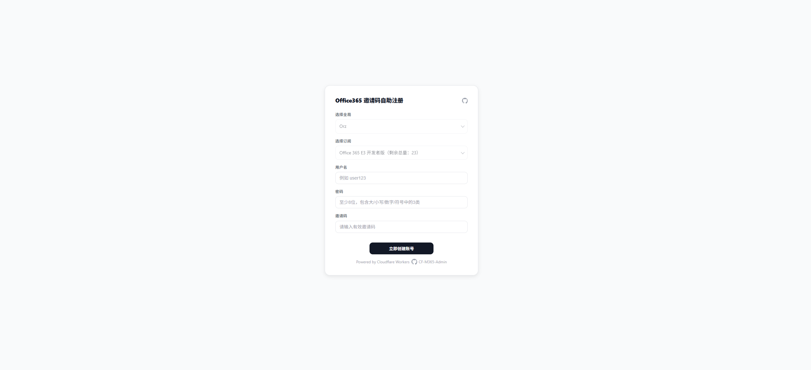
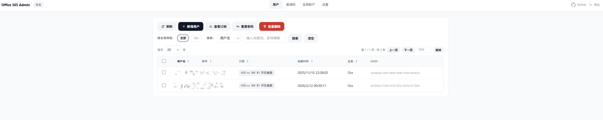

# CF-M365-Admin

A community-friendly **Microsoft 365 (Office 365) self-service provisioning and lightweight admin panel** powered by **Cloudflare Workers + Microsoft Graph API**.  
Serverless, fast to deploy, and practical for labs, internal self-service, demos, or small-to-mid teams.

> Note: This is a technical tool, not an “account distribution service”. You are responsible for compliance (see Disclaimer).

---

## 📸 Screenshots / Demo

### Example 1: Main Interface / Function Demonstration

*Note: This is the minimalist self-service / invitation code registration interface displayed to users.*

### Example 2: Backend Interface / Management Display

*Note: This is the management interface, supporting multi-tenant management, user authorization, and a flexible invitation code system.*

---

## 🚀 Complete Rebuild & Enhancements vs. V1

Compared to the early version which only provided basic "URL token validation," "single-tenant hardcoded configuration," and "rough interfaces," V3 has undergone a complete, from-the-ground-up rebuild.
Here are the core additions and major enhancements:

### 🔒 Massive Architecture & Security Upgrades
- **Completely Ditched Hardcoded Configs**: Added a **Visual First-Time Setup Wizard**. Early versions required you to manually write massive `SKU_MAP` and environment keys in the Cloudflare config page or code. Now, all global accounts, API keys, and sensitive info are entered through an intuitive UI and securely encrypted into Cloudflare KV for persistence.
- **Replaced Plaintext URL Tokens with High-Spec Session Auth**: The old version allowed forced access to the backend simply by appending `?token=xxx` to the URL, creating huge leak and sniffing risks. The new version switches to secure HttpOnly Cookies to store session keys, and supports an active "Logout" click to destroy credentials, achieving a complete modern login verification loop.
- **Anti-Probing & Smart Fallback Protection**: Added interception for unauthorized, erroneous requests, or scanning scripts, automatically redirecting them all back to the homepage or throwing a friendly 404 page, completely hiding the real address of the admin backend.
- **Integrated Anti-Abuse & Risk Constraints**: The frontend natively integrates Cloudflare Turnstile human verification, combined with a high-risk sensitive word dictionary interception mechanism (protecting accounts like `admin`, `root` from being registered or accidentally deleted), fundamentally preventing abuse by malicious scripts.

### 🏢 Perfect Support for Multi-Tenant (Multiple Global Accounts)
- **Visual Multi-Global Management**: Upgraded from only supporting a fixed single tenant to **unlimited multiple global mounts**. You can dynamically add, delete, modify, and query multiple global management credentials (Tenant ID, Client Secret) in the backend, and the system will automatically fetch their corresponding subscription quotas.
- **Fully Automated Smart SKU Fetching**: No more tedious searching for boring SKU ID mappings in the Graph Explorer! When configuring a new global account, simply click "Fetch SKU", and the system will automatically grab the subscriptions in seconds, displaying automatically matched localized names on the UI.

### 🛡️ Subscription Isolation & Authorization Control (Core Original Feature)
- **"Castrated" Distribution Precise to Specific Apps**: The old version could only assign entire SKU authorizations. The new V3 version **pioneers a "Fine-Grained Permission Control" feature**. Whether directly creating an account in the backend or generating an invitation code on the frontend, you can **check and strip out core components that are easily abused by blackhats, such as cloud drives (OneDrive/SharePoint), mail (Exchange), and Teams**, greatly protecting the lifespan of the main tenant!
- **Smart Invitation Codes with Isolated Scopes**: Rebuilt the invitation code logic. Invitation codes can now accurately restrict to "Only register Subscription B under Global A, and prohibit the use of OneDrive." Supports bulk generation of pure uppercase, unconfusable format invitation codes with fixed prefixes, and visually displays the remaining quota of the invitation code.

### 🧑‍💻 Doubled User Management Experience
- **High-Performance Frontend & Data Management**: Added multi-combination search conditions and pagination processing in the user management interface (supports fuzzy search and multi-level sorting based on account, username, global affiliation, and owned SKU categories).
- **Strengthened Password Reset Logic**: Supports batch selecting users to execute operations. When resetting passwords, admins can now choose between "Manual Entry" and "Auto-Generate High-Strength Compliant Password", which better fits operational workflows. The frontend password form also fully implements real-time validation of "3 out of 4 (Upper/Lower/Number/Symbol) and length no less than 8 characters."

---

## 🧩 V3 Upgrade & Migration Guide (Read This)

If you are upgrading from the early single-file (environment variable configuration) version, please note the following core architectural changes:

### 1) Configuration Persistence: Changed from Env Vars to Cloudflare KV
Older versions usually configured large blocks of `SKU_MAP` and `ADMIN_TOKEN` environment variables in `wrangler.toml` or the panel.  
**The new version introduces `CONFIG_KV`**. All settings (including global accounts, admin paths, anti-abuse keys) are operated in the UI and encrypted/stored in KV.
> Upgrade Tip: Just keep the basic `CONFIG_KV` binding. You can reconfigure your globals and app mappings through the admin backend, which will be very smooth and supports automatic SKU fetching.

### 2) Access Control: Authentication Upgrade & Anti-Abuse Integration
The old version directly used plain text URLs with Tokens (like `/?token=xxx`) to access the backend.  
**The new version uses a secure admin entry path (like `/admin`) to log in**, validating with a username/password and an HttpOnly Session Cookie.  
> Highly Recommended: Fill in the Cloudflare Turnstile Site Key and Secret Key in the backend settings to enable registration anti-abuse.

### 3) Invitation Codes & Permission Isolation (Major Upgrade)
Early subscription provisioning often granted all application permissions under that subscription (including OneDrive, Exchange, etc.).  
**The new version adds a "Disable Application Permissions" feature**. When generating invitation codes or creating accounts directly in the backend, you can check and remove cloud drive and email components that are easily abused by blackhats, protecting the main tenant's security.

### 4) Security Protection: 404 & Smart Redirection Fallbacks
All frontend inputs now have strict regex validation and error feedback; for all abnormal or probing requests, it automatically redirects back to the login page or throws a clean 404 Not Found interface. A logout button has also been added to the management panel, which upon clicking immediately invalidates the Cookie to prevent browser residue.

---

## 🛠️ Prerequisites

You will need:  
1. **Cloudflare Account**: For deploying Workers and binding KV.  
2. **Microsoft 365 Global Admin Privilege**: To register an Azure AD (Entra ID) application.  
3. **Azure AD (Entra ID) App Information**:
   - Get `Client ID`, `Tenant ID`.
   - Create a `Client Secret` (save its Value).  
   - Configure Graph API permissions: Add `User.ReadWrite.All`, `Directory.Read.All` (Optional), `Organization.Read.All` (Optional) under **Application permissions**, and execute **Grant admin consent**.  

---

## ⚙️ Cloudflare Workers Deployment Tutorial

### 1) Create KV Namespace
Go to Cloudflare Dashboard -> Workers & Pages -> KV -> Create namespace  
Name it: `CONFIG_KV`

### 2) Create Worker Script
Create a new Worker, completely copy and paste the contents of the latest `worker_v3.js` (or other main file) from the repository into it.

### 3) Bind KV
In the current Worker's Settings -> Variables & Secrets -> KV Namespace Bindings:
- Variable name: `CONFIG_KV`
- KV namespace: Select the KV you just created

### 4) Save and Deploy
Visit the domain assigned to the Worker (e.g., `xxx.workers.dev`), and it will automatically enter the **First-Time Installation Wizard page**.

---

## 🚀 Quick Start (First Experience)

1. **Initialize Backend**: Open your domain, set the admin account, password, and your desired backend path (e.g., `/admin-panel`) in the wizard.
2. **Log into Backend**: Enter using the account you just set up.
3. **Add Global Account**: Go to "Global Accounts" and fill in the TenantId, ClientId, and ClientSecret information you applied for in Azure.
4. **Sync SKUs**: After filling in the info, click "Fetch SKU" in the modal. The system will automatically connect to Microsoft to pull your subscription list. Click save.
5. **Enable Protection (Optional)**: Go to "Settings" to configure Turnstile keys and enable human verification. Enable invitation code mode.
6. **Distribute & Use**: Go to "Invitation Code Management", generate exclusive invitation codes for specific subscriptions to distribute to users. Users can register instantly by entering them on the homepage!

---

## 🧯 Troubleshooting

- **404 on backend / Cannot enter**: You probably forgot your custom admin path, or the Session expired. Re-enter using the path you set during installation (e.g., `/admin`).
- **"Fetch SKU" failed**: First check if there are any extra spaces in the TenantId / ClientId / ClientSecret, and whether the correct API permissions were given and **Admin Consent was granted** in Entra ID.
- **Cannot fetch disableable application services**: Only when selecting a **single** subscription while generating invitation codes or creating accounts in the backend can it correctly match and fetch the Service Plans included under it.

---

## ⚠️ Disclaimer

This project is provided as an open-source technical tool. You are responsible for ensuring your deployment and usage comply with applicable laws and the terms/policies of Microsoft, Cloudflare, and any other relevant providers.  
The authors and contributors are not liable for any direct or indirect damages arising from the use, misuse, or abuse of this project, including account suspension, tenant restrictions, service disruption, data loss, licensing/compliance risks, or legal consequences.  
If you plan to use it in an organization or commercial context, we recommend performing a security review, applying least-privilege permissions, and protecting admin routes with additional access controls.

---

## License

MIT License
